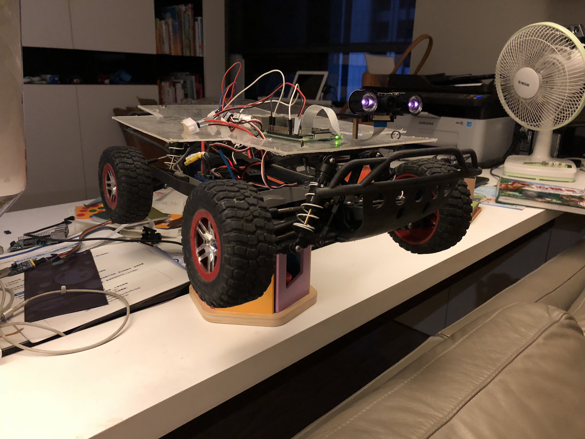
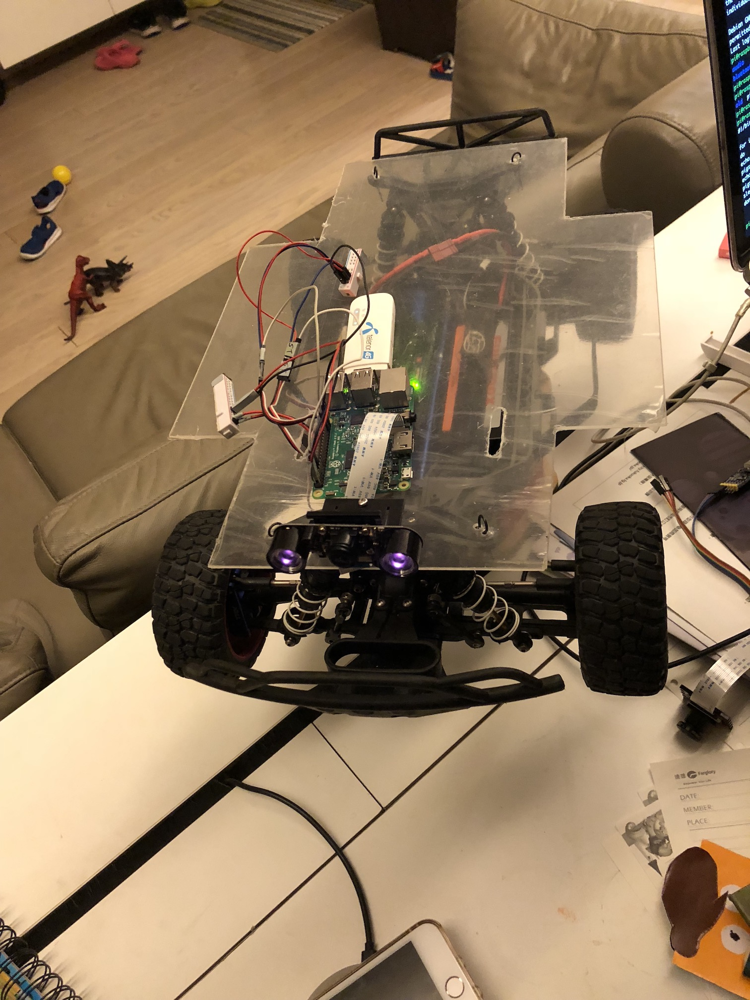
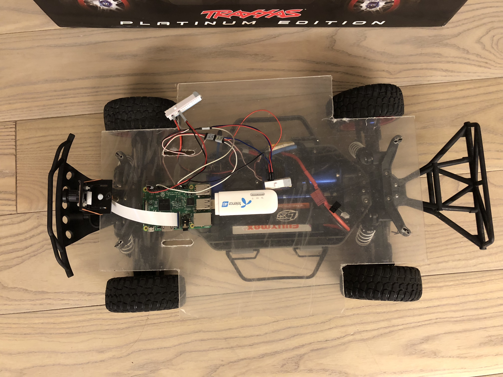
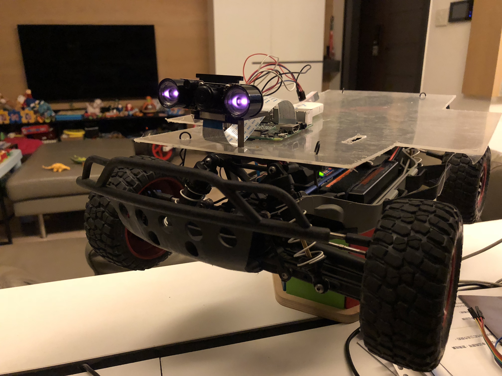
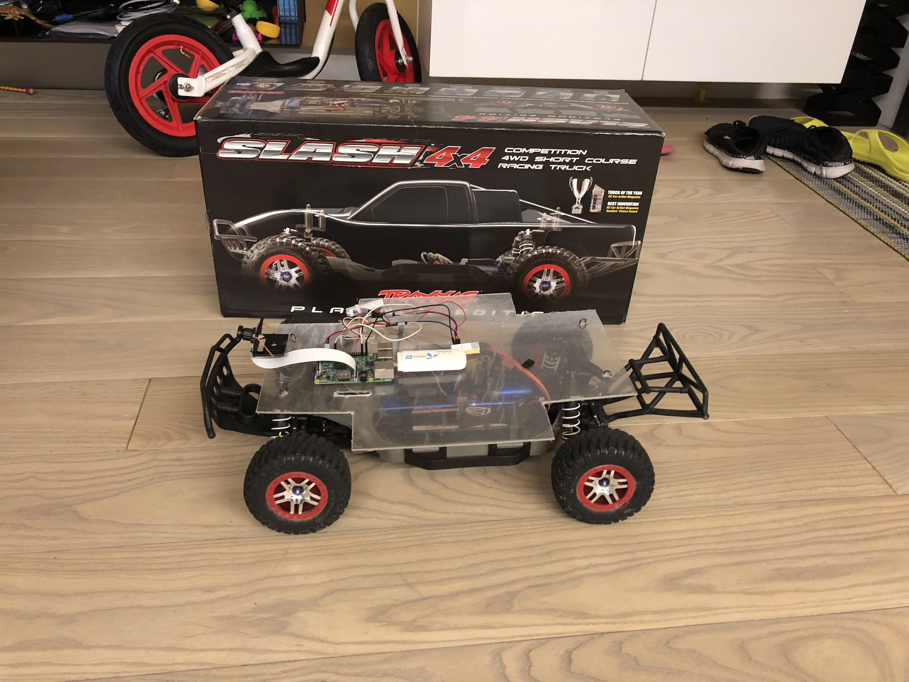
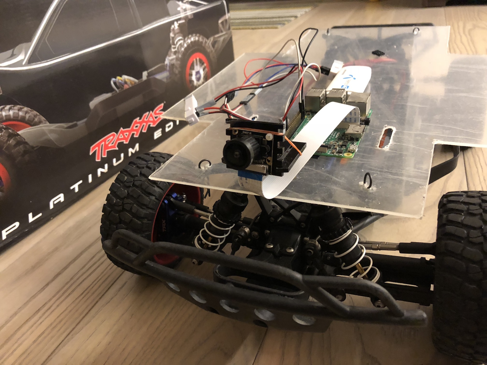
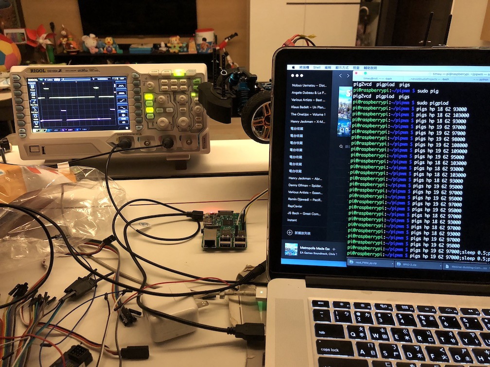

# SelfDriving RC Car
some notes about the WIP self driving RC car project

## overviews
* 1
* 2

## wide angle camera with night IR

## LTE adaptor

## topview light

## box top

## frontview near sight

## withbox side

## boxtop 2

## observe the PWM emit from PI with an oscilloscope

### throttle and steering test

