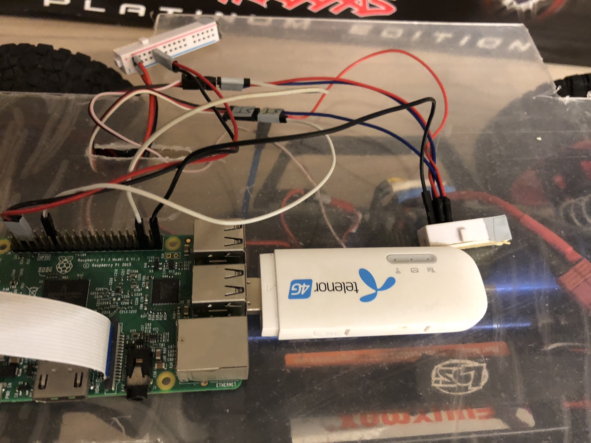

# SelfDriving RC Car
some work notes about the WIP self driving RC car project

## Tasks overview
* [x] choose a RC car
* [x] install the 2nd floor deck
* [x] control RC's throttle and steering with PWM
* [x] ensure the PI camera works
* [x] LTE internet connection
* [x] H.264 RTMP upload
* [x] object detection server(SSD+MobileNet) via tensorflow on google cloud
* [x] Live view on browser

## with Slash 4x4 Slash box

## LTE adaptor

## wide angle camera with night IR

## take a closer look

## observe the PWM emit from PI with an oscilloscope

## throttle and steering test (click to watch on youtube)

